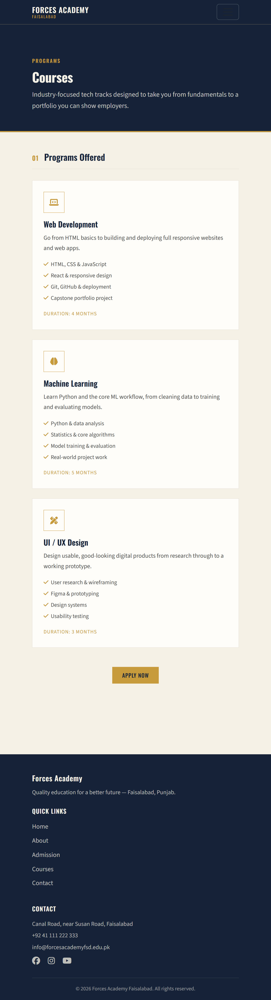
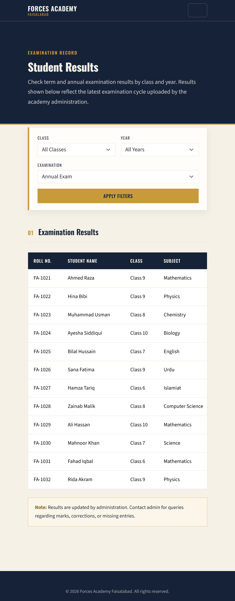

# Forces Academy Faisalabad — Website

A responsive, multi-page website for **Forces Academy**, an educational institute in Faisalabad, Punjab. The site covers admissions, course offerings, a photo gallery, student results, and a contact page — built with a clean navy/gold/cream academic theme.

## 🔗 Live Site
[View Live Site](https://ayesha-code28.github.io/forces-academy-frontend-codesaviours-si26-ayesha/)

## 📸 Screenshots

| Home Page | Courses Page | Results Page |
|---|---|---|
|  |  |  |

## 🛠 Tech Stack
- **HTML5** — semantic page structure
- **CSS3** — custom theme (`css/style.css`) with CSS variables for colors/typography
- **Bootstrap 5.3.3** — responsive grid, navbar, carousel, forms
- **JavaScript (Vanilla)** — form validation, filters, animated counters, back-to-top button (`js/main.js`)
- **Font Awesome 6.5.2** — iconography
- **Google Fonts** — Oswald & Source Sans 3
- **GLightbox** — lightbox gallery viewer

## ✨ Features
- Fully responsive design (desktop, tablet, mobile)
- Multi-page navigation: Home, About, Admission, Courses, Gallery, Results, Contact
- Animated statistics counters on the homepage (students taught, years of excellence, etc.)
- Bootstrap testimonial carousel with student reviews
- Admission page with step-by-step apply guide, eligibility, required documents, and fee structure table
- Course catalog for Web Development, Machine Learning, and UI/UX Design tracks
- Photo gallery with category filtering (All / Events / Sports / Academic) and lightbox viewer
- Student Results portal with filter by class, year, and examination type
- Contact page with:
  - Client-side validated contact form
  - Office info cards (address, phone, email, hours)
  - Embedded Google Map
  - Social media links
- Sticky navbar with mobile hamburger menu
- Back-to-top button on every page

## 📁 Project Structure
## 🚀 Getting Started
1. Clone the repository:
```bash
git clone https://github.com/ayesha-code28/forces-academy-frontend-codesaviours-si26-ayesha.git
```
2. Open `index.html` in your browser — no build step required.

## ✅ Testing
Site has been tested across Chrome, Firefox, and Edge, and verified for mobile responsiveness using Chrome DevTools device emulation.

## 👤 Built By
**Ayesha Saddiqa** | Code Saviours SI-26 | 2026